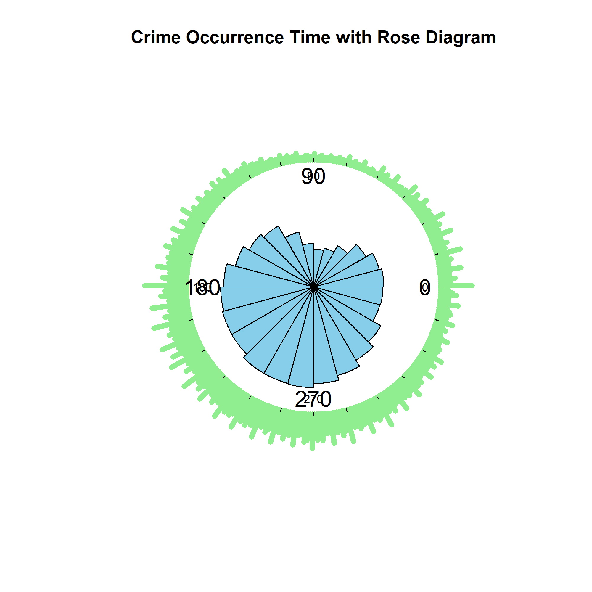
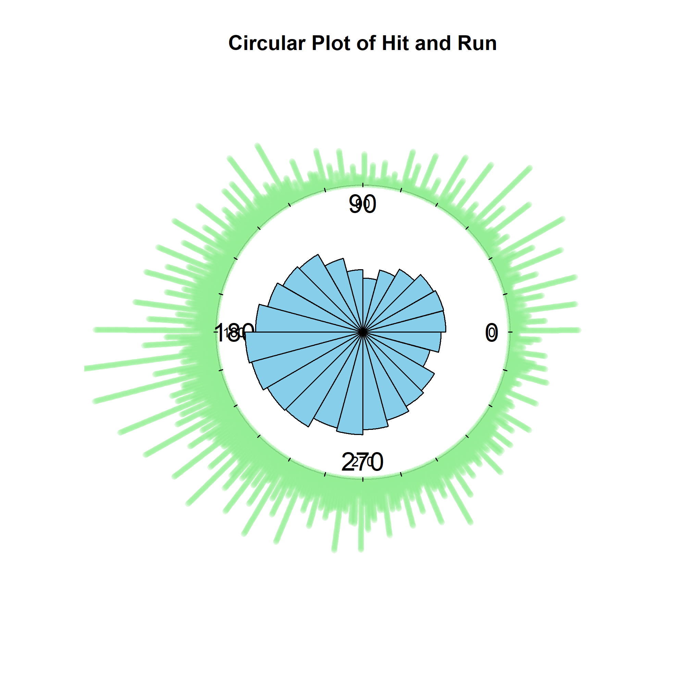
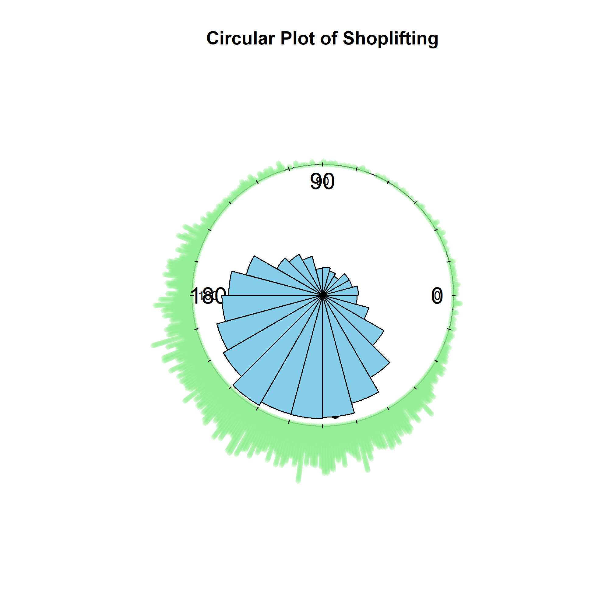
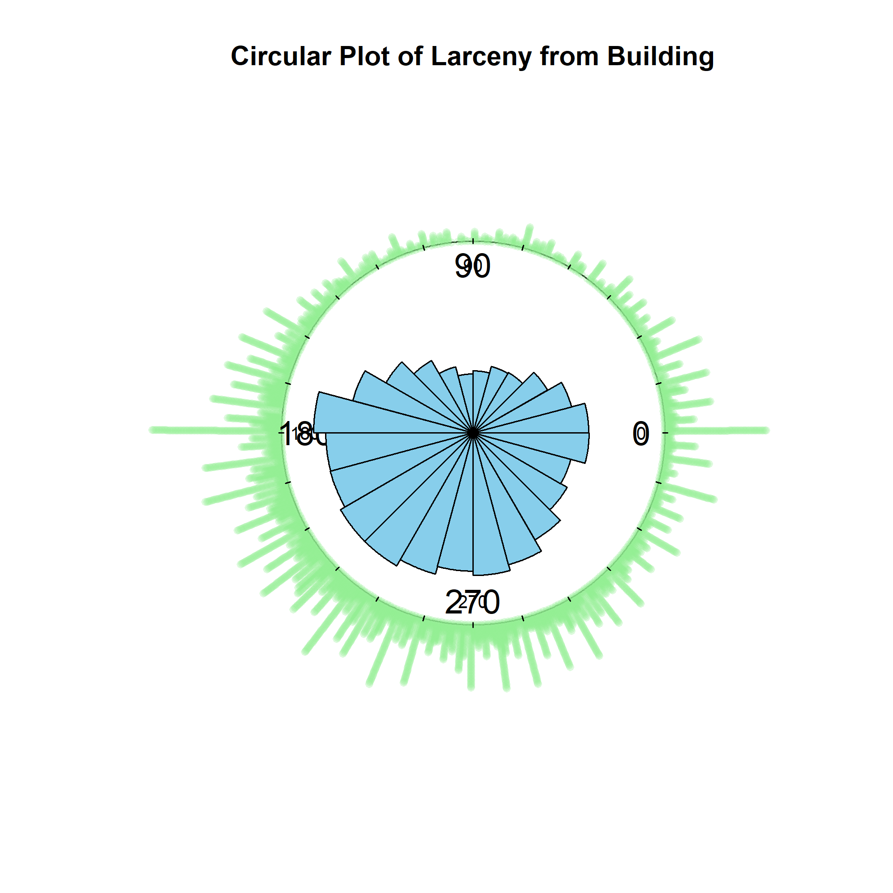
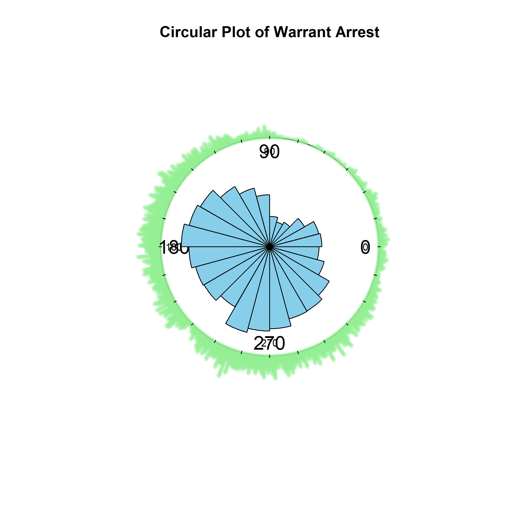
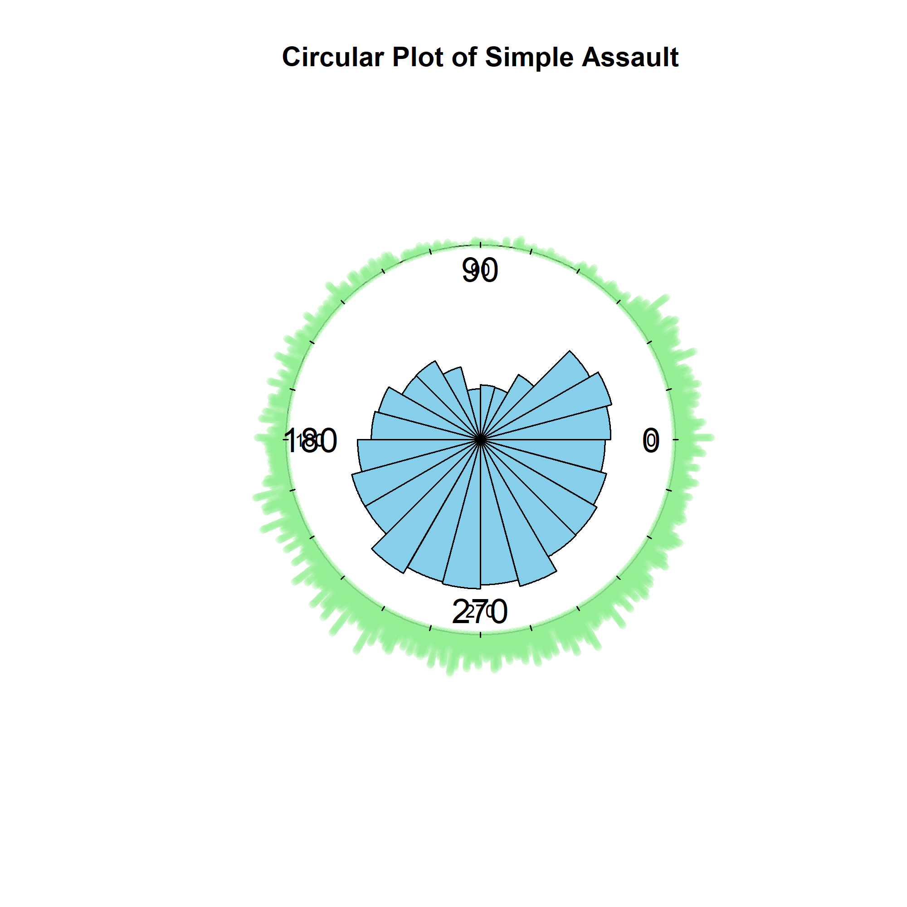
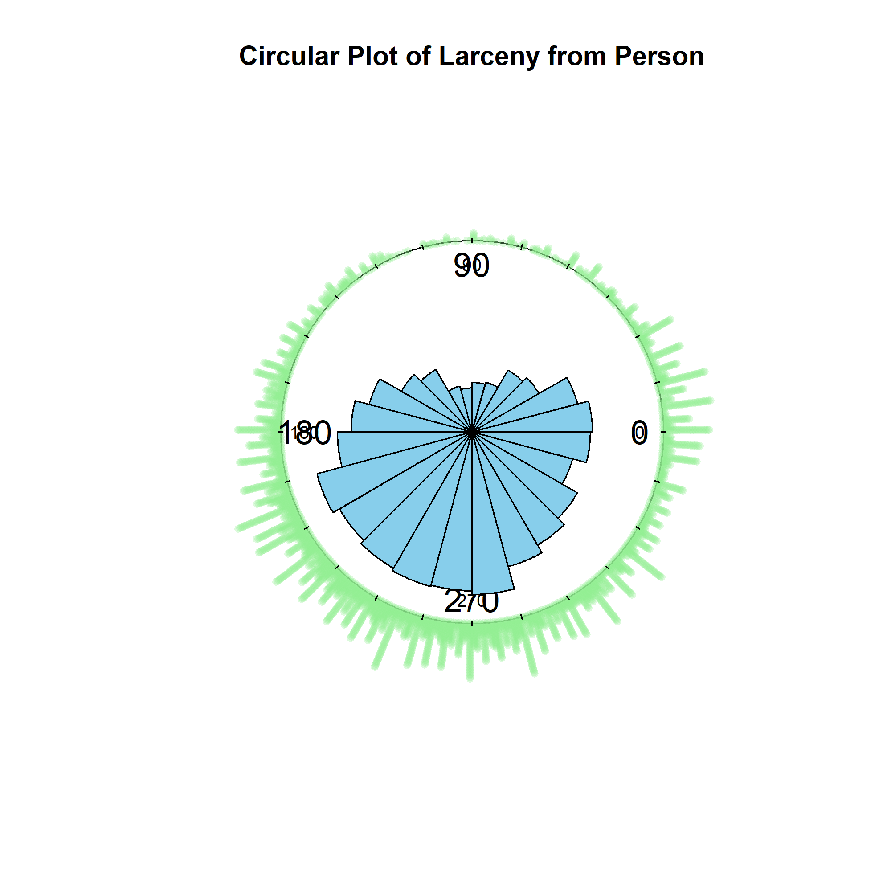

```{R}
if(!require(circular)) install.packages("circular")

library(circular)
library(tidyverse)
library(lubridate)
library(ggplot2)
library(dplyr)
```

```{r}
crime_data <- read.csv("Crime_Reports_20240701.csv", stringsAsFactors = FALSE)

str(crime_data)

head(crime_data)
```

```{r}
crime_type_counts <- crime_data %>%
  count(Crime) %>%
  arrange(desc(n))

ggplot(crime_type_counts %>% top_n(20, n), aes(x = reorder(Crime, n), y = n)) +
  geom_col(fill = "steelblue") +
  coord_flip() +
  labs(title = "Top 20 Crime Types", x = "Crime Type", y = "Count")
```

Crime Date Time includes 2 types of time: time interval and time point. Try to pick the medians of time intervals to convert them into time points. (This would lead to misinterpreting when the time interval is relatively long. Consider to split the start points and end points of crimes using regular expression and `lubridate` , and hence compute the length of time interval.)

```{r}
crime_data <- crime_data %>%
  mutate(
    Start_Time = str_extract(Crime.Date.Time, "^[0-9/ :]+"),
    End_Time = str_extract(Crime.Date.Time, "(?<=- )[0-9/ :]+"),
    
    Start_Time = mdy_hm(Start_Time),
    End_Time = case_when(
      is.na(End_Time) ~ Start_Time,
      str_detect(End_Time, "/") ~ mdy_hm(End_Time),
      TRUE ~ mdy_hm(paste(format(Start_Time, "%m/%d/%Y"), End_Time))
    ),
    Duration_Minutes = as.numeric(difftime(End_Time, Start_Time, units = "mins")),
    Median_Time = Start_Time + (Duration_Minutes / 2) * 60
  )
```

Duration minutes has unexpected negative value, delete.

```{r}
crime_data <- crime_data %>%
  filter(Duration_Minutes >= 0)
```

Use box plot to show the lengths of intervals by types of crimes.

```{r}
crime_data %>%
  filter(Duration_Minutes < quantile(Duration_Minutes, 0.99, na.rm = TRUE)) %>%
  ggplot(aes(x = reorder(Crime, Duration_Minutes, FUN = median), y = Duration_Minutes)) +
  geom_boxplot(outlier.shape = NA, fill = "steelblue", alpha = 0.7) +
  coord_flip() +
  scale_y_continuous(limits = c(0, quantile(crime_data$Duration_Minutes, 0.98, na.rm = TRUE))) +
  labs(title = "Crime Duration by Type (Excluding Longest 1%)", x = "Crime Type", y = "Duration (Minutes)") +
  theme_minimal()
```

For the types of crimes with small duration time, consider to use their median time as the crime time.

```{r}
crime_median_duration <- crime_data %>%
  group_by(Crime) %>%
  summarise(Median_Duration = median(Duration_Minutes, na.rm = TRUE))

filtered_crime_data <- crime_data %>%
  filter(Crime %in% crime_median_duration$Crime[crime_median_duration$Median_Duration <= 60]) %>%
  filter(!is.na(Duration_Minutes) & is.finite(Duration_Minutes))

upper_limit <- boxplot.stats(filtered_crime_data$Duration_Minutes)$stats[5]

ggplot(filtered_crime_data, aes(x = reorder(Crime, Duration_Minutes, FUN = median), y = Duration_Minutes)) +
  geom_boxplot(outlier.shape = NA, fill = "steelblue", alpha = 0.7) +  
  coord_flip() +
  scale_y_continuous(limits = c(0, upper_limit)) + 
  labs(title = "Crime Duration by Type (Median ≤ 60 min)", 
       x = "Crime Type", y = "Duration (Minutes)") +
  theme_minimal()

```

Convert `filtered_crime_data` into `circular`.

```{r}
circular_crime_data <- filtered_crime_data %>%
  filter(!is.na(Median_Time))

circular_crime_data <- circular_crime_data %>%
  mutate(
    Hour = hour(Median_Time),
    Minute = minute(Median_Time),
    
    Total_Minutes = Hour * 60 + Minute,
    
    Time_Angle = (Total_Minutes / 1440) * 360  # 1440分钟 = 24小时
  )

circular_crime_data$Circular_Time <- circular(circular_crime_data$Time_Angle, units = "degrees", modulo = "asis")

circular_crime_data <- circular_crime_data %>%
  select(Crime, Circular_Time)
```

Row plot and Rose plot

```{r}
png("total_crime.png", width = 2000, height = 2000, res = 300)
plot.new()
plot(circular_crime_data$Circular_Time, stack=TRUE, col="lightgreen", shrink=1.5, cex=0.8, bin=360, sep=0.001,
     main="Crime Occurrence Time with Rose Diagram")
rose.diag(circular_crime_data$Circular_Time, bins=24, col="skyblue", cex=1.5, prop=3, add=TRUE)
dev.off()
```

{width="50%"}

Find the most frequent 6 types of crime

```{r}
top_crimes <- circular_crime_data %>%
  count(Crime, sort = TRUE) %>%
  top_n(6, n)

ggplot(top_crimes, aes(x = reorder(Crime, n), y = n)) +
  geom_col(fill = "steelblue") +
  coord_flip() +
  labs(title = "Top 6 Most Frequent Crimes", x = "Crime Type", y = "Frequency") +
  theme_minimal()
```

```{r}
top_crime_types <- top_crimes$Crime

filtered_top_crimes <- circular_crime_data %>%
  filter(Crime %in% top_crime_types)

for (crime_type in top_crime_types) {
  
  crime_subset <- filtered_top_crimes %>%
    filter(Crime == crime_type)
  
  png_filename <- paste0(gsub(" ", "_", crime_type), "_circular_plot.png")
  png(png_filename, width = 2000, height = 2000, res = 300)
  
  plot.new()
  plot(
    crime_subset$Circular_Time, 
    stack = TRUE, 
    col = adjustcolor("lightgreen", alpha.f = 0.3), 
    shrink = 1.5,  
    cex = 0.8,     
    bin = 360,     
    sep = 0.01,    
    main = paste("Circular Plot of", crime_type)
  )
  
  rose.diag(
    crime_subset$Circular_Time, 
    bins = 24, 
    col = "skyblue", 
    cex=1.5, 
    prop=3, 
    add=TRUE
  )
  
  dev.off()
}
```

{width="50%"}

{width="50%"}

{width="50%"}

{width="50%"}

{width="50%"}

{width="50%"}

What to do next:

Test uniformity and reflective symmetry for each case;

Choose von Mises distribution or inverse Batschelet distribution to fit;

Construct confidence intervals;

Comment on goodness-of-fit;

Analysis by months or seasons