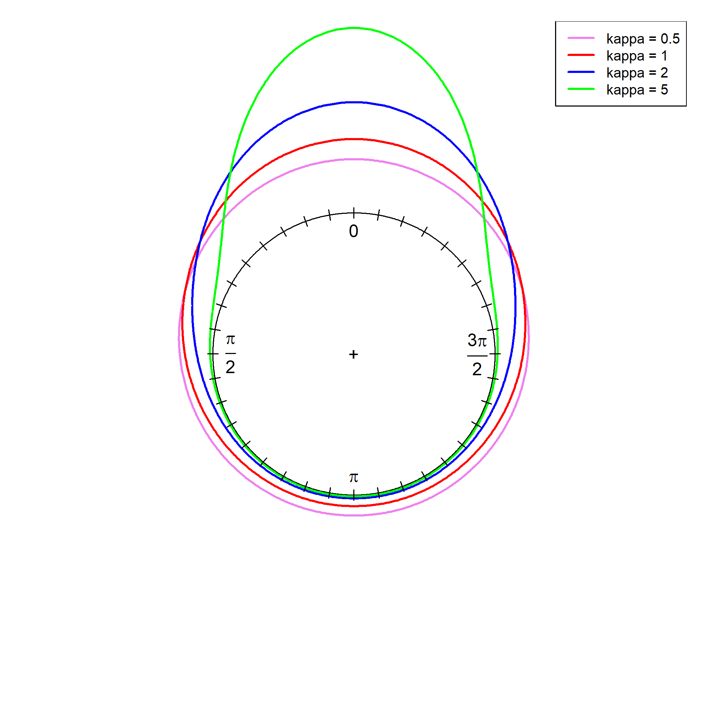
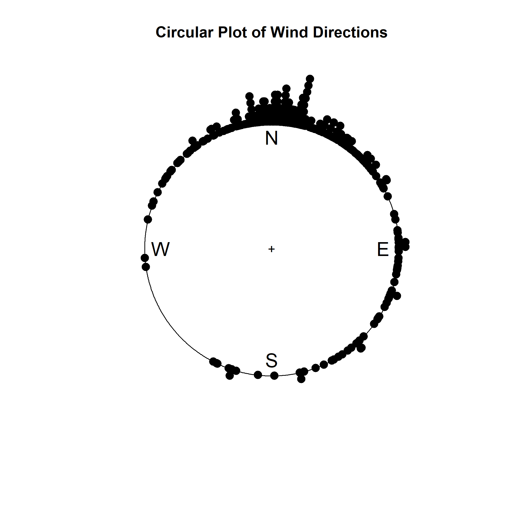
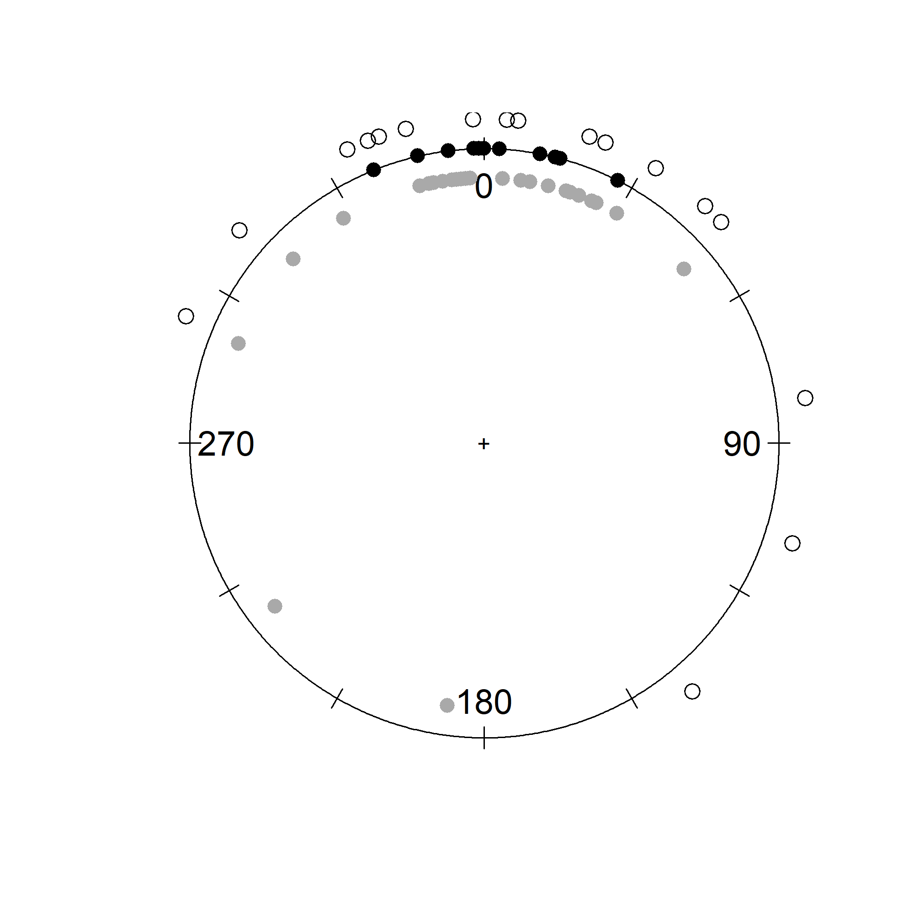
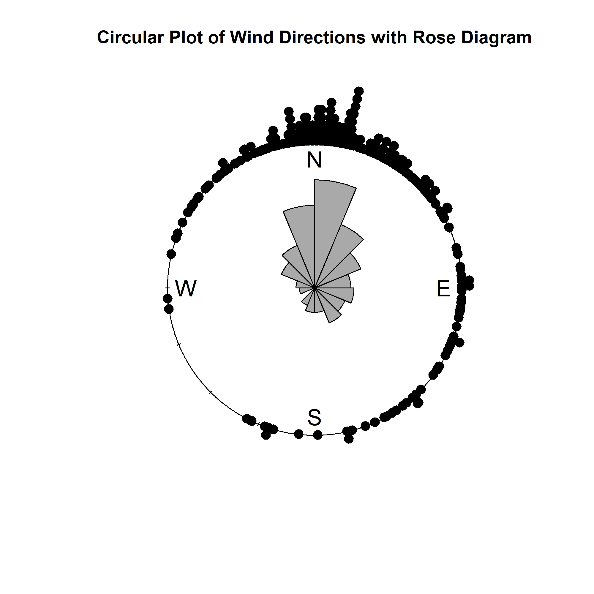
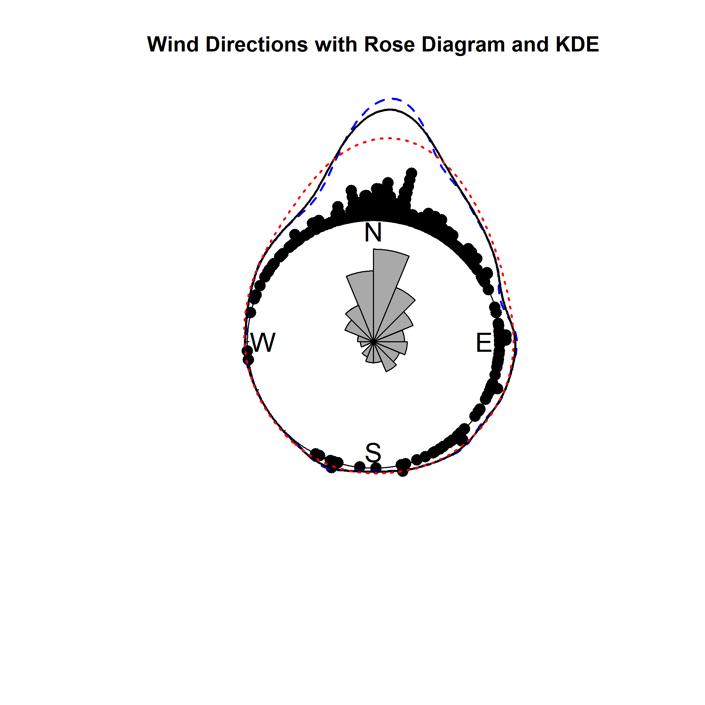

```{R}
if(!require(circular)) install.packages("circular")

library(circular)
```

# Definition and Calculation of the Mean Direction

*This section need to be integrated into "Summary Statistics" section*

In statistics, the **mean direction** refers to the central tendency of a set of directional data, commonly used for circular or angular data, such as wind direction or movement direction. Since directional data is periodic, meaning $0^\circ = 360^\circ$, the typical arithmetic mean does not apply to such data. Thus, the mean of directions is calculated using vector-based methods.

## Calculation of the Mean Direction

Suppose we have a set of directional data, denoted as $\theta_1, \theta_2, \dots, \theta_n$, which are measured in either radians or degrees. To calculate the mean direction, we first convert each direction to a unit vector and sum them:

$$
C = \sum_{i=1}^n \cos \theta_i \quad S = \sum_{i=1}^n \sin \theta_i
$$

Next, the resultant vector's length $R$ is computed (and thus we have the mean resultant length $\bar{R} = R/n$ ,) as well as the cosine and sine values of the mean direction:

$$
R^2 = C^2 + S^2 \quad \text{(where} \, R \geq 0 \text{)}
$$

$$
\cos \bar{\theta} = \frac{C}{R} \quad \sin \bar{\theta} = \frac{S}{R}
$$

Here, $$\bar{\theta}$$ represents the mean direction, which is the direction of the unit vector defined by $C$ and $S$. However, directly using $\cos \bar{\theta} = C/R$ and $\sin \bar{\theta} = S/R$ may lead to undefined results when $C = 0$ or $S = 0$. Therefore, a more robust approach is to use the **atan2** function to compute the mean direction.

## Using the $\operatorname{atan2}$ Function to Calculate the Mean Direction

The function **atan2** is a special arctangent function that takes into account both the values of $S$ and $C$, and it correctly handles the signs of these values to return the proper angle. Unlike the standard arctangent function $\text{atan}(y/x)$, $\text{atan2}(y, x)$ can handle boundary cases, such as when $C = 0$ or $S = 0$, without producing undefined results.

$$
\bar{\theta} = \operatorname{atan2}(S, C)
$$

Where:

-   $S = \sum_{i=1}^n \sin \theta_i$
-   $C = \sum_{i=1}^n \cos \theta_i$

The result of $$\text{atan2}(S, C)$$ will always be an angle in the interval $(-\pi, \pi]$, ensuring a unique result and avoiding ambiguities due to the periodic nature of angles.

## Definition of the $\operatorname{atan2}$ Function

The $\text{atan2}$ function computes the principal argument of the complex number $x + iy$, which is also the imaginary part of the complex logarithm. Specifically, the definition of $\text{atan2}(y, x)$ is:

$$
\operatorname{atan2}(y, x) = \arg(x + iy) = \text{Im} \log(x + iy)
$$

-   $\text{atan2}(y, x)$ calculates the principal argument of the complex number $x + iy$, which is the imaginary part of its logarithm.
-   Adding any integer multiple of $2\pi$ (representing complete rotations around the origin) gives another argument of the same complex number, but the principal argument is defined as the unique representative angle in the interval $(-\pi, \pi]$.

In terms of the standard arctangent function, whose image is $(-\frac{\pi}{2}, \frac{\pi}{2})$, $\text{atan2}$ can be expressed piecewise:

$$
\operatorname{atan2}(y, x) =
\begin{cases}
\text{atan}(y/x) & \text{if} \, x > 0 \\
\text{atan}(y/x) + \pi & \text{if} \, x < 0 \text{ and } y \geq 0 \\
\text{atan}(y/x) - \pi & \text{if} \, x < 0 \text{ and } y < 0 \\
\text{atan}(y/x) + 2\pi & \text{if} \, x = 0 \text{ and } y > 0 \\
\text{atan}(y/x) - 2\pi & \text{if} \, x = 0 \text{ and } y < 0 \\
\text{undefined} & \text{if} \, x = 0 \text{ and } y = 0
\end{cases}
$$

# The von Mises Distribution

The **von Mises distribution** is a symmetric unimodal distribution widely used for modeling circular data. It is commonly used when we have samples that exhibit a central tendency around a single mean direction.

We will plot the density functions for the von Mises distribution with `R` package `circular`.

```{R}
mu <- circular(0) # Set the mean direction at o
kappas <- c(0.5, 1, 2, 5)

angles <- seq(0, 2*pi, length.out = 720)

densities <- list() # To store the value of PDFs at each points
for (kappa in kappas) {
  density <- dvonmises(angles, mu = mu, kappa = kappa) # This should return a vector, since argument x is a vector 
  densities[[as.character(kappa)]] <- density
}

# Plot
png("von_mises_circular_plot.png", width = 2000, height = 2000, res = 300)
plot.new()
par(mar = c(1, 1, 1, 1))
plot(circular(list()), zero = pi/2, bin = 720, shrink = 2.1)
colors <- c("violet", "red", "blue", "green")
for (i in seq_along(kappas)) {
  lines.circular(angles, densities[[as.character(kappas[i])]] * 1.5 + 0.01, 
                 col = colors[i], lwd = 2, zero = pi/2)
}
legend("topright", legend = paste("kappa =", kappas),
       col = colors, lwd = 2, cex = 0.8)
axis.circular(
  at = circular(seq(0, 2 * pi - pi / 18, by = pi / 18)),
  labels = rep("", 36),
  tcl = 0.075,
  zero = pi/2,
  rotation = "clock"
)
dev.off()
```



## Probability Density Function (PDF)

The probability density function (PDF) for the von Mises distribution is:

$$
f(\theta) = \frac{1}{2\pi I_0(\kappa)} \exp\left( \kappa \cos(\theta - \mu) \right), \quad 0 \leq \theta < 2\pi, \quad 0 \leq \kappa < \infty
$$

Where: $\mu$ is the **mean direction**, $\kappa$ is the **concentration parameter**, which measures how tightly the data points cluster around the mean direction, $I_0(\kappa)$ is the modified Bessel function of order zero, which normalizes the distribution.

## Cumulative Distribution Function (CDF)

The cumulative distribution function (CDF) does not have a simple closed form, but it can be computed numerically:

$$
F(\theta) = \frac{1}{2\pi I_0(\kappa)} \int_0^\theta \exp\left( \kappa \cos(\phi - \mu) \right) d\phi
$$

## Moments

The key moments for the von Mises distribution are:

1.  **Mean Direction** ($\mu$): The central direction around which the data points are clustered.
2.  **Mean Resultant Length** ($\rho = A_1 (\kappa)$ ): A measure of how tightly the data points are clustered around the mean direction. It ranges from 0 (uniform distribution) to 1 (all points at the mean direction).
3.  **Circular Dispersion** ($\delta = \left[ \kappa A_1(\kappa) \right]^{-1}$): A measure of the spread or concentration of the data points.
4.  **Higher Moments** ($\alpha_p = A_p(\kappa)$ ): These moments are used to describe higher-order features of the distribution.

As $\kappa$ increases, the distribution becomes more concentrated around the mean direction $\mu$, and as $\kappa \to 0$, the distribution approaches a uniform distribution over the circle.

## Limiting Forms

-   As $\kappa \to 0$, the von Mises distribution approaches the **uniform distribution** on the circle ($U_C$).
-   As $\kappa \to \infty$, the von Mises distribution becomes a **point distribution** concentrated around the mean direction $\mu$.

# Visualization

## Raw Circular Data Plots

The package `circular` contains a dataset `wind`, which stores the wind direction (for a total of 310 measures) recorded at Italian Alps. We aim to show how to plot a raw circular data using this dataset. And since `wind` is not a circular data object, this section will also include type conversion of standard data object.

```{R}
library(circular)
windc <- circular(wind, type="angles",units="radians",template="geographics")

png("raw_data_plot.png", width = 2000, height = 2000, res = 300)
plot.new()
plot(windc, stack=TRUE, col="black", shrink=1.3, cex=1.5, bin=720, sep=0.035,
     main="Circular Plot of Wind Directions")
dev.off()
```



Each black dot corresponds to an individual wind direction measurement, plotted around the unit circle. The stacking of points at certain angles indicates repeated observations of the same wind direction, suggesting predominant wind patterns.

For comparison, we plot the same data set linearly.

```{R}
plot(wind, pch=16, col="black",
     xlab="Observation Number", 
     ylab="Wind Direction (in radians)",
     main="Linear Plot of Wind Directions")

```

A linear plot of circular data, such as wind directions, can be misleading because it does not account for the periodicity of the data. In a linear representation, angles close to **0 and 2π (or 360°)** appear far apart, even though they represent nearly the same direction. This can distort patterns and make it difficult to recognize cyclic trends. In the `wind` dataset, the circular plot clearly shows a peak concentration of wind directions around **0°**. However, in the linear plot, this same feature appears as two separate peaks at the uppermost and lowermost edges of the graph, which may lead to incorrect interpretations.

### Plotting Multiple Datasets *(draft)*

Here, `fisherB10` which contains 11 sets of the walking directions of ants is used to show a effective way to plot multiple datasets in a single figure.

```{R}
png("multi_data_plot.png", width = 2000, height = 2000, res = 300)
plot.new()
plot(fisherB10c$set1, units="degrees", zero=pi/2, rotation="clock", pch=16, cex=1.5)
ticks.circular(circular(seq(0, (11/6)*pi, pi/6)), zero=pi/2, 
               rotation="clock", tcl=0.075)
points(fisherB10c$set2, zero=pi/2, rotation="clock", pch=16,
       col="darkgrey", next.points=-0.1, cex=1.5)
points(fisherB10c$set3, zero=pi/2, rotation="clock", pch=1, 
       next.points=0.1, cex=1.5)

dev.off()
```



What is worth noting is that the data points are not stacking compared to Figure 1.1, this is because we used `bin = 720` and `stack = TURE` in Figure 1.1 but left it be default here. Under the setting of `bin` and `stack = TRUE`, all data points were mapped to fixed angle intervals, while they will be not if we leave it as `bin = NULL` and `stack = FALSE` as default. `next.points` is used to shift the points of different datasets onto different positions, to prevent them from being squeezed into a same circle.

## Rose Diagrams (Circular Version of Histogram)

A Rose Diagram is a circular histogram used to visualize directional or cyclic data. It is similar to a traditional histogram but adapted for angular measurements such as wind direction, animal migration paths, earthquake directions, etc. Each sector represents a specific direction, and its area or radius is proportional to the frequency of data points in that direction.

```{R}
png("rose.png", width = 2000, height = 2000, res = 300)
plot.new()
plot(windc, stack=TRUE, col="black", shrink=1.3, cex=1.5, bin=720, sep=0.035,
     main="Circular Plot of Wind Directions with Rose Diagram")
rose.diag(windc, bins=16, col="darkgrey", cex=1.5, prop=1.3, add=TRUE)
dev.off()
```



The choice of amount of segments for the data to split into is worth considering. Too many segments may hide the details, while too few may lead to overfitting. The authors of *Circular Statistics in R* suggest that the square root of data size is often a reasonable first guess, and the values 4, 8, 12, 16, 18, 32 and 36 are popular choices.

## Kernel Density Estimation *(draft)*

Kernel Density Estimation (written as KDE here) is a non-parametric statistical method for estimating the PDF of a dataset. Unlike rose diagrams, KDE is not affected by the choice of bins and provides a smooth density curve, and provides a smooth density curve using continuous kernel functions.

The KDE is given as

$$
\hat{f}(\theta) = \frac{1}{nh} \sum_{i=1}^{n} w\left(\frac{\theta - \theta_i}{h}\right)
$$

where $w(\theta)$ is a weight function, $n$ is data size, and $h$ controls how *smooth* the KDE is. A von Mises kernel is chosen as the default option of the weight function $w$ for the `density.circular` function in `circular` package, while wrapped normal kernel is available. Other types of kernels are not implemented in this package, but are still available for statistics practice.

We continue to add a KDE onto our figure of `wind`, where `bw` works as $h$:

```{R}
png("KDE.png", width = 2000, height = 2000, res = 300)
plot.new()
plot(windc, stack=TRUE, col="black", shrink=1.8, cex=1.5, bin=720, sep=0.035,
     main="Wind Directions with Rose Diagram and KDE")
rose.diag(windc, bins=16, col="darkgrey", cex=1.5, prop=1.3, add=TRUE)
lines(density.circular(windc, bw = 75), lwd = 2, lty = 2, col = "blue")  # too smooth
lines(density.circular(windc, bw = 40), lwd = 2, lty = 1, col = "black")   # proper
lines(density.circular(windc, bw = 10), lwd = 2, lty = 3, col = "red") # overfitting
dev.off()
```



## Linear Histogram *(I think it is unnecessary)*

```{R}
par(mfrow = c(1,2))

hist(wind, main = " ", xlab = "Wind direction (radians)", ylab = "Frequency", 
     breaks = seq(from = 0, to = 2 * pi, by = pi / 8), 
     col = "grey", xlim = c(0, 2 * pi))

n <- length(wind) 
cutpoint <- 2 * pi - (5 * pi / 8) 
windshift <- numeric(n)

for (j in 1:n) { 
  if (wind[j] >= cutpoint) { 
    windshift[j] <- wind[j] - 2 * pi 
  } else { 
    windshift[j] <- wind[j] 
  }
}

hist(windshift, main = "", xlab = "Wind direction (radians)", ylab = "Frequency", 
  breaks = seq(from = -5 * pi / 8, to = 2 * pi - 5 * pi / 8, by = pi / 8), 
  col = "grey", xlim = c(-5 * pi / 8, 2 * pi - 5 * pi / 8))

par(mfrow = c(1, 1)) 
```

# Summary Statistics

On a **unit circle**, a circular data point can be express as a unit vector:

$$
x = (\cos\theta, \sin\theta)
$$

As well as complex form:

$$
z = e^{i\theta}=\cos\theta+i\sin\theta
$$

## Sample Trigonometric Moment

For a circular dataset with size $n$, each data point corresponds to a unit vector $x_j$, an angle $\theta_j$, and a complex number $z_j=e^{i\theta_j}$.

The $p$**-th trigonometric** moment is defined as

$$
t_{p,0} = \frac{1}{n} \sum_{j=1}^{n} z_j^p = \frac{1}{n} \sum_{j=1}^{n} e^{ip\theta_j} = \frac{1}{n} \sum_{j=1}^{n} (\cos p\theta_j + i \sin p\theta_j) = a_p + i b_p
$$

where

$$
a_p = \frac{1}{n} \sum_{j=1}^{n} \cos p\theta_j \quad 
b_p = \frac{1}{n} \sum_{j=1}^{n} \sin p\theta_j
$$ with $a_p=a_{-p}$, $b_p=b_{-p}$, $t_{0,0}=1$.

It defines a vector in complex plane with length

$$
\bar{R}_p = \left( a_p^2 + b_p^2 \right)^{1/2} \in [0,1],
$$

and with direction

$$
\bar{\theta}_p = \operatorname{atan2}(b_p, a_p).
$$

### Sample Mean Direction and Sample mean resultant length

Sample Mean resultant vector is the **1st trigonometric moment**.

*Move the first section here!!*

### $p$-th trigonometric about the mean direction

$$
t_{p,\bar{\theta}} = \frac{1}{n} \sum_{j=1}^{n} e^{i p (\theta_j - \bar{\theta})} = \frac{1}{n} \sum_{j=1}^{n} \left( \cos p (\theta_j - \bar{\theta}) + i \sin p (\theta_j - \bar{\theta}) \right) = \bar{a}_p + i \bar{b}_p,
$$

where

$$
\bar{a}_p = \frac{1}{n} \sum_{j=1}^{n} \cos p (\theta_j - \bar{\theta}), \quad
\bar{b}_p = \frac{1}{n} \sum_{j=1}^{n} \sin p (\theta_j - \bar{\theta}).
$$
